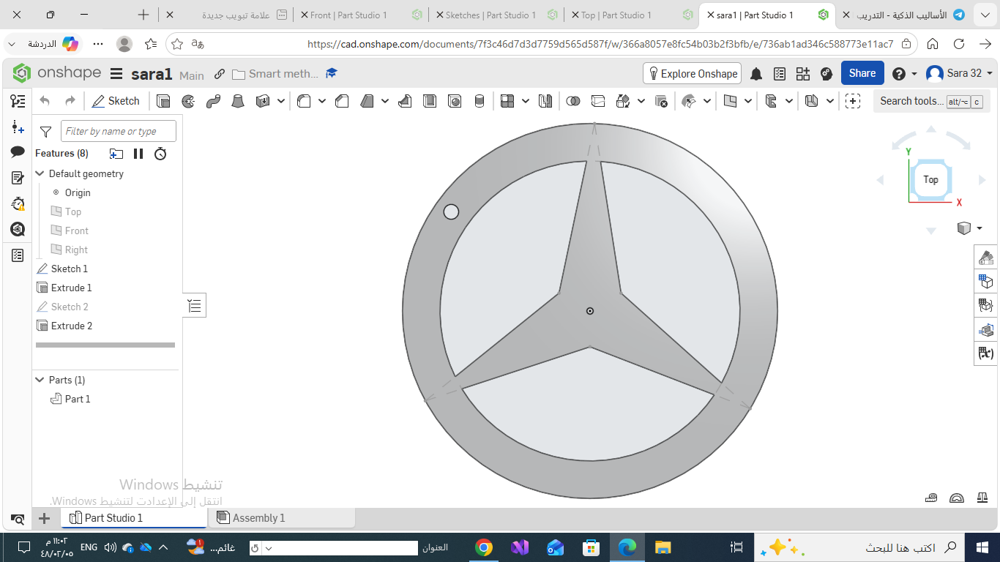

# mercedes-logo-onshap
Designed the Mercedes-Benz logo in Onshape as part of my Mechanical Engineering track. The project demonstrates sketching, geometric constraints, and 3D extrusion using CAD.

# Mercedes Logo Design - Onshape

## Overview
This project was completed as part of my Mechanical Engineering learning track. The goal was to recreate the Mercedes-Benz logo using Onshape while practicing fundamental CAD modeling skills.

## Objectives
- Create an accurate 2D sketch of the logo.
- Apply geometric constraints and dimensions.
- Convert the sketch into a 3D model using the Extrude feature.
- Improve precision and CAD design skills.

## Tools Used
- Onshape
- CAD Modeling

## Features
- 2D Sketch
- Geometric Constraints
- Extrude Feature
- Basic 3D CAD Model

## Skills Gained
- Sketching
- Parametric Design
- 3D Modeling
- CAD Fundamentals

## Preview

## Onshape Project
https://cad.onshape.com/documents/7f3c46d7d3d7759d565d587f/w/366a8057e8fc54b03b2f3bfb/e/736ab1ad346c588773e11ac7?renderMode=0&uiState=6a5d2d714db7cf1288f630fa
## Auther
Sarah Saud Alotaibi
